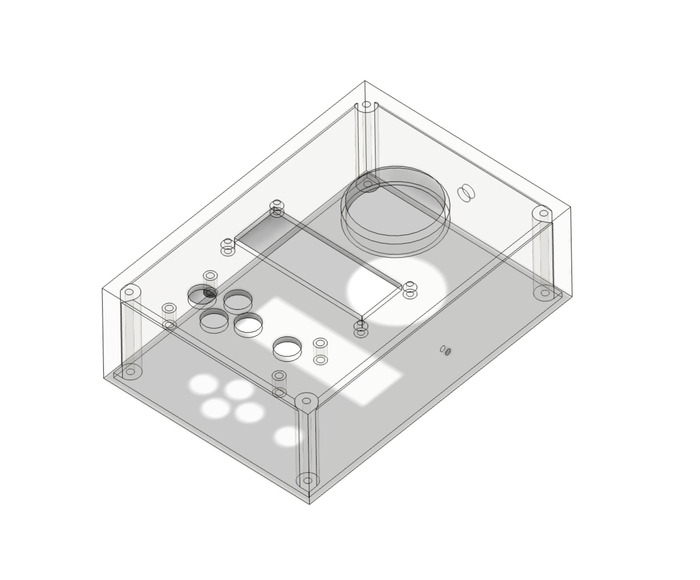

# ESP32 Temperature and humidity controller

This is an Arduino code for a temperature and humidity controlling monitoring system using a DHT22 sensor and an LCD display.
The system can display the temperature and humidity readings on the LCD screen,
and the user can adjust the desired temperature setpoint through a menu interface.

## Getting Started

To get started with the ESP32 Temperature and humidity controller, you will need to install the PlatformIO IDE on VSCode.
Once you have installed the PlatformIO IDE, you can clone this repository and open the project in the IDE.

## Parts

- ESP32
- DHT22
- LCD Display 16x2
- ADKeyboard
- Relay 250A 10A

## 3D STL file in 3D_print folder

- box.stl - 3D model of the case Fusion 360
- FBG5_box.gcode - Gcode for 3D printing on Flying Bear Ghost 5

## Circuit Diagram

- not ready yet

## Contribution

If you have any questions or concerns about making a contribution, it's important to communicate with me.
I can provide guidance on what is needed or how to proceed with the contribution.

## Documentation

For more information on the ESP32 and PlatformIO, please refer to the official documentation:

- [ESP32 Documentation](https://docs.espressif.com/projects/esp-idf/en/latest/get-started/index.html)
- [PlatformIO Documentation](https://docs.platformio.org/en/latest/)

## License

This project is licensed under the MIT License - see the [LICENSE](LICENSE) file for details.
